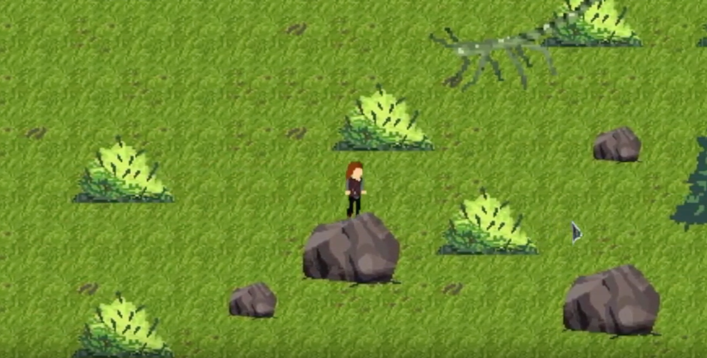
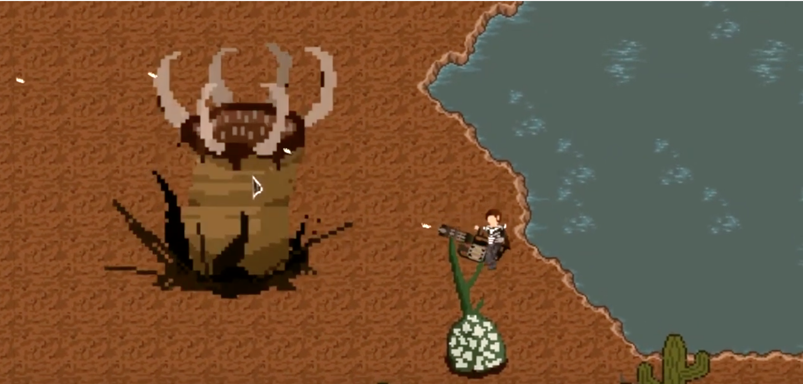
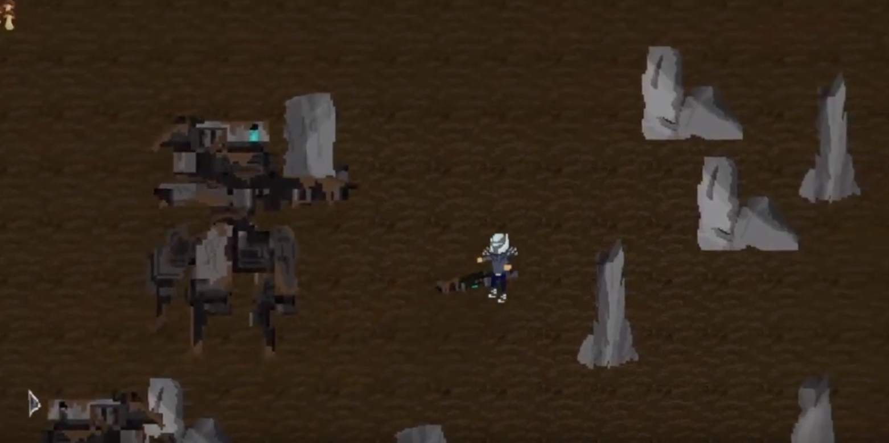
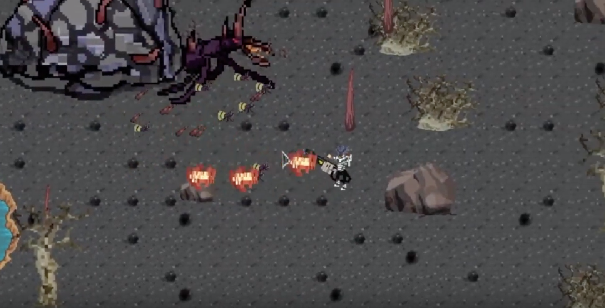

# Epilogue
Epilogue is a game with multiple survival challenges, simulating a future nuclear apocalypse that has been bestowed upon the world. The effects of a hydrogen bomb have brought great devastation to the survivors of all species in the local area as the infected have gone through different states of mutations and the loss of sanity. You as the player will have a choice of being one of many survivors who are unaffected by radiation with varying strengths and weaknesses to find and repair a fallen space shuttle in order to escape the dead planet. You will be placed in a challenging simulation with the addition of real-life survival needs; such as hunger, thirst, energy, and etc. Moreover, in addition to reconstructing the spacecraft, you must find all the materials that are required for its repair. Some are easy to obtain, but others are guarded by powerful creatures. Throughout your adventure, you will be able to explore a massive island, build bases, and construct tools, weapons, and armours to survive through this journey.

# Development
Epilogue is created by the Cyclone Development Team. It is a survival game that is released on itch.io for $2.99USD.
Credits: 
https://www.project-epilogue.com/credits/

# Youtube Trailer
https://www.youtube.com/watch?v=kvCcecXtYjM

# Download and Official Website
https://www.project-epilogue.com

# Trailer Images

